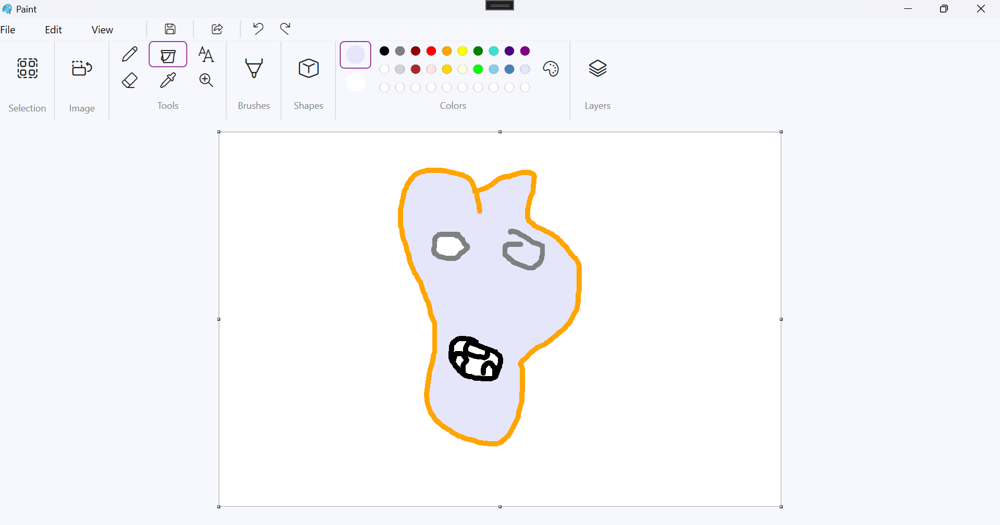

# MSPaintProj

A simple paint application built with C# and WPF, inspired by Microsoft Paint. This project aims to replicate some of the core functionalities of the classic Paint program using modern .NET technologies.

## Features

*   **Drawing Tools:** Pencil, Brush (with adjustable size), Eraser (with adjustable size).
*   **Shape Tools:** Draw Lines, Rectangles, and Ellipses.
*   **Color Management:**
    *   Select Primary and Secondary colors.
    *   Predefined color palette.
    *   Color Picker (Eyedropper) tool to select colors from the canvas.
*   **Fill Tool:** Flood fill areas with the selected color.
*   **Selection Tool:**
    *   Select rectangular regions.
    *   Cut, Copy, and Paste selections.
    *   Move selected regions.
*   **Canvas:**
    *   Resizable canvas using drag handles.
    *   Zoom in/out using Ctrl + Mouse Wheel.
*   **File Operations:**
    *   Create a New canvas.
    *   Open image files (PNG, JPG, BMP).
    *   Save the canvas as an image file (PNG, JPG, BMP).
*   **Undo/Redo:** Multi-level undo and redo functionality for drawing actions.

## Screenshot



## Planned Features (Based on Implementation Plan)

*   Rulers & Gridlines
*   Status Bar Information
*   Full Screen Mode
*   Image Properties Dialog
*   Text Tool
*   Layers Support
*   Importing images onto the canvas
*   Setting canvas as Desktop Background
*   Sharing functionality
*   Recent Files list
*   Thumbnail Preview
*   Printing

## Technologies Used

*   C#
*   Windows Presentation Foundation (WPF)
*   .NET 8

## Getting Started

1.  **Clone the repository:**
    ```bash
    git clone <repository-url>
    cd MSPaintProj
    ```
2.  **Open the solution:** Open `MSPaintProj.sln` in Visual Studio (2022 or later recommended).
3.  **Build the solution:** Press `Ctrl+Shift+B` or go to `Build > Build Solution`.
4.  **Run the application:** Press `F5` or click the Start button.

## Contributing

Contributions are welcome! If you have suggestions or find bugs, please open an issue. If you'd like to contribute code, please fork the repository and submit a pull request.